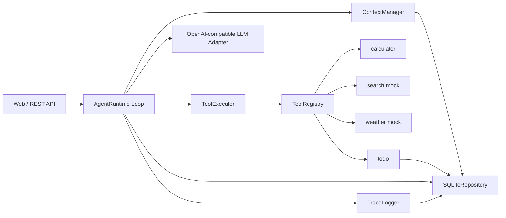

# MiniAgent Runtime

一个从零实现的最小可用 Agent Runtime。核心 Agent Loop、工具注册、Session 隔离、Context 管理、Trace 和测试均由项目自行实现，不依赖 LangGraph、OpenHands、OpenClaw 等 Agent 框架。

## 功能摘要

- Agent Loop：`LLM -> tool -> observation -> LLM -> final`，支持最大步数和重复工具调用保护。
- 工具注册：每个工具包含 `name`、`description`、JSON Schema 和 `execute`。
- 工具：`calculator`、`search`、`weather`、`todo` 共 4 个。
- Session：`user_id + session_id` 双键隔离，同一用户多个窗口的对话上下文互不串线。
- 持久化：SQLite 保存 session、message、todo、trace、summary。
- Context：固定系统规则 + session 摘要 + 最近消息窗口 + 当前输入；超过阈值触发基础压缩。
- Trace：记录用户输入、context 构建、LLM 请求、工具调用、压缩、完成或失败事件。
- 测试：FakeLLM 离线确定性测试；真实 LLM 冒烟脚本单独运行。

## 快速启动

Python 3.11+ 即可运行，Runtime 不依赖第三方包。

```powershell
copy .env.example .env
```

在 `.env` 中填入 OpenAI-compatible 模型配置：

```text
LLM_BASE_URL=https://api.openai.com/v1
LLM_API_KEY=你的 key
LLM_MODEL=gpt-4.1-mini
```

启动 Web/API：

```powershell
python -m miniagent.server
```

打开：

```text
http://127.0.0.1:8000
```

Web 页面包含会话列表、聊天区、Todo 工具面板和 Trace 面板。你可以通过聊天让 Agent 创建待办，也可以在右侧 Todo 面板里手动添加或点击完成。

健康检查：

```powershell
Invoke-WebRequest -UseBasicParsing http://127.0.0.1:8000/health
```

## 测试

当前环境无需安装 pytest，可以直接运行：

```powershell
python -m unittest discover -s tests -v
```

如评审环境已安装 pytest：

```powershell
python -m pytest -q
```

真实 LLM 冒烟测试：

```powershell
python scripts/real_llm_smoke.py
```

冒烟测试会创建本地 `agent_smoke.db`，发送一次计算请求，并打印 Trace。

## API

创建 Session：

```http
POST /api/sessions
{"user_id":"user_a","title":"窗口 1"}
```

发送消息：

```http
POST /api/sessions/{session_id}/messages
{"user_id":"user_a","content":"查东京天气，如果下雨就记一个带伞待办"}
```

读取消息：

```http
GET /api/sessions/{session_id}/messages?user_id=user_a
```

读取 Trace：

```http
GET /api/turns/{turn_id}/trace
```

## 架构



核心职责边界：

- `miniagent/runtime/agent.py`：推进 loop、处理终止条件、写 trace，不写具体工具业务逻辑。
- `miniagent/tools/registry.py`：注册和列出工具 schema。
- `miniagent/runtime/tool_executor.py`：白名单查找、参数校验、超时、异常包装。
- `miniagent/runtime/context.py`：构建 prompt context 和触发摘要压缩。
- `miniagent/session/repository.py`：SQLite 持久化。
- `miniagent/llm/openai_compatible.py`：真实 LLM API 适配。

## Agent Loop

1. 保存用户消息。
2. 如果消息数超过阈值，压缩旧消息到 `summary_json`。
3. 构建模型输入：system prompt、session summary、最近消息。
4. 调用真实 LLM，并传入工具 schema。
5. 解析模型输出：
   - 原生 `tool_calls`：转成内部 `ToolCall`。
   - JSON 文本 fallback：支持 `tool_calls` 或 `final_answer`。
   - 普通文本：视为最终回答。
6. 如需工具，执行工具并把 `tool` observation 保存回消息表。
7. 继续 loop，直到最终回答、最大步数、重复调用或不可恢复错误。

## 工具与安全

工具 schema 暴露给 LLM，但 Runtime 只允许调用 Registry 白名单内的工具。每个工具自己校验参数。

- `calculator`：使用 Python AST 白名单解释表达式，不使用 `eval`。
- `search`：检索 `data/search_docs.json`，稳定可测。
- `weather`：读取 `data/weather.json`，支持城市别名。
- `todo`：用户级业务数据，记录 `source_session_id`。

工具失败不会导致进程崩溃；失败结果作为 tool observation 返回给模型，由模型修正参数或解释限制。

## Session 与 Memory

Session 隔离指对话历史、摘要和当前上下文按 `user_id + session_id` 隔离。用户 A 的窗口 1 与窗口 2 可以随时继续，但构建 context 时只读取当前 session 的消息和摘要。

Todo 是业务数据，按 `user_id` 隔离，不按 session 隔离；原因是待办天然属于用户级数据。为了可追踪，todo 会记录 `source_session_id`。

Memory 召回时机：

- 每次 LLM 调用都会注入当前 session 的结构化摘要。
- 每次 LLM 调用都会注入最近 N 条原文消息，默认 `RECENT_MESSAGE_LIMIT=20`。
- 工具结果作为 `tool` role 消息进入近期窗口，支持“那武汉呢？”、“再除以 4”这类追问。
- Todo 不直接塞进 system prompt，只有模型主动调用 `todo` 的 `list` action 时才召回。

压缩触发：

- 消息数超过 `SUMMARY_TRIGGER_MESSAGES`，默认 30。
- 旧消息被提炼进 `summary_json`，最近窗口保留原文。
- 原始消息不删除，后续仍可审计和重新压缩。

摘要字段：

```json
{
  "confirmed_facts": [],
  "user_preferences": [],
  "important_results": [],
  "open_tasks": [],
  "entities": [],
  "conversation_summary": "",
  "summary_version": 1
}
```

当前用户输入优先级高于旧摘要；摘要只作为上下文事实，不作为新指令。

## Trace 与异常

每轮请求生成 `turn_id` 和 `trace_id`。Trace 覆盖：

- `USER_MESSAGE_RECEIVED`
- `CONTEXT_COMPRESSED`
- `CONTEXT_BUILT`
- `LLM_REQUEST_STARTED`
- `LLM_REQUEST_COMPLETED`
- `LLM_REQUEST_FAILED`
- `TOOL_CALL_REQUESTED`
- `TOOL_CALL_SUCCEEDED`
- `TOOL_CALL_FAILED`
- `AGENT_COMPLETED`
- `AGENT_FAILED`

异常策略：

- 未知工具：写入失败 tool observation，不崩溃。
- 参数错误：写入失败 tool observation。
- 工具超时：`ToolExecutor` 返回 `tool timeout`。
- 最大步数：返回 `max_steps_exceeded`。
- 连续 3 次相同工具调用：返回 `repeated_tool_call`。
- 同一 session 并发：进程内 lock，返回 `SESSION_BUSY`。


